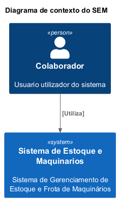
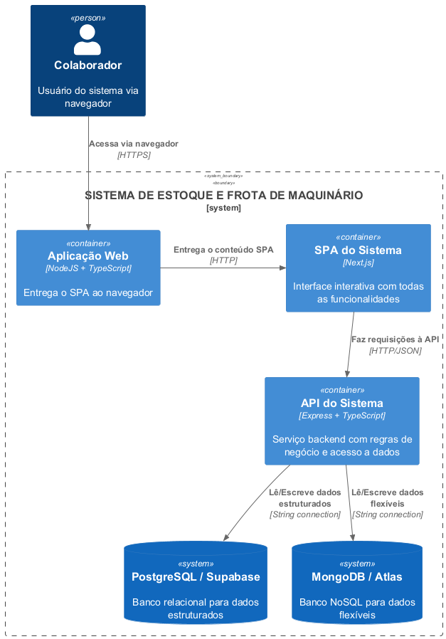
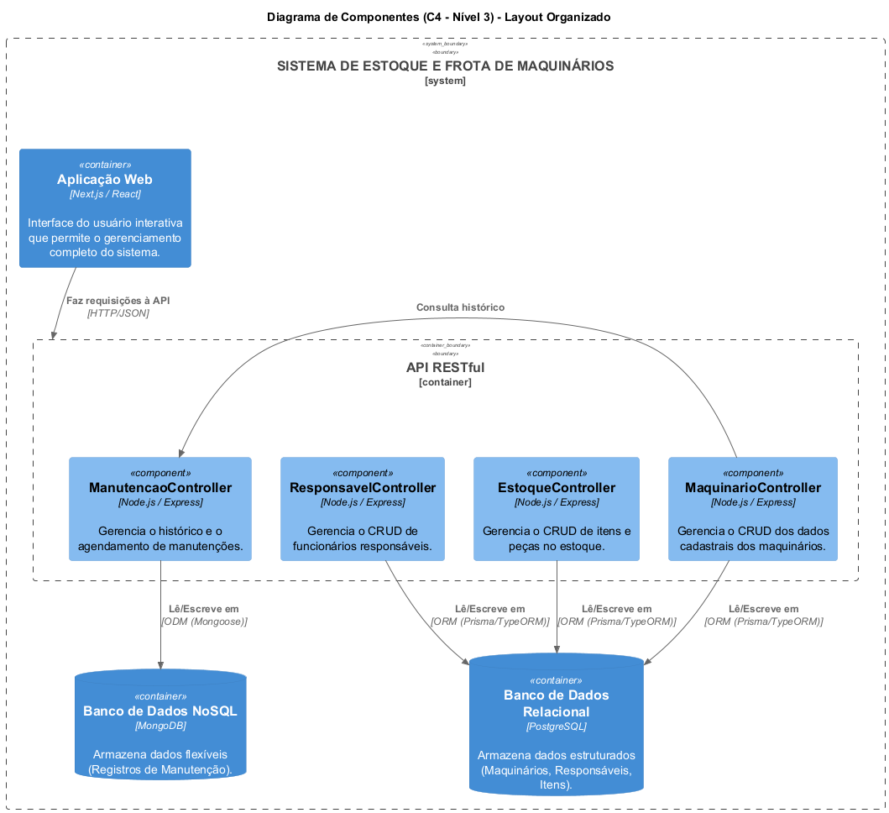

# DOCUMENTO DE ARQUITETURA DE SOFTWARE

Este documento armazena as decisões relacionadas à arquitetura do sistema de software, cobrindo os requisitos de qualidade, a visão arquitetural e a estrutura do projeto.

---

## VISÃO GERAL DA ARQUITETURA

O Sistema de Gerenciamento de Estoque e Manutenção de Maquinários é uma aplicação web construída sobre uma arquitetura moderna e desacoplada. As quatro partes principais são:

- **Frontend (Cliente)**: Uma Single-Page Application (SPA) desenvolvida com Next.js (React) e TypeScript, responsável pela interface do usuário e interação.
- **Backend (Servidor)**: Uma API RESTful construída com Node.js, Express e TypeScript, que contém toda a lógica de negócio.
- **Persistência de Dados**: Um banco de dados NoSQL MongoDB, gerenciado pelo ODM Mongoose, para armazenar todos os dados da aplicação.
- **Mensageria (Pub/Sub)**: Um servidor Redis que atua como um barramento de eventos, publicando mensagens de operações (CRUD) para permitir a integração com outros sistemas de forma assíncrona.

Essa arquitetura visa proporcionar flexibilidade, manutenibilidade e escalabilidade.

---

## ESTILO ARQUITETURAL ADOTADO

O estilo arquitetural principal é **Cliente-Servidor (Client-Server)**, aprimorado com uma **Arquitetura Orientada a Eventos (Event-Driven Architecture)** para comunicação externa.

- **Cliente**: A aplicação frontend (Next.js) que roda no navegador.
- **Servidor**: A API Backend (Node.js/Express) que processa requisições HTTP.
- **Comunicação Orientada a Eventos**: Após cada operação de escrita (Create, Update, Delete), a API publica um evento no Redis. Isso desacopla o sistema principal de quaisquer outros microsserviços ou integradores que possam precisar reagir a essas mudanças no futuro.

---

## REQUISITOS DE QUALIDADE

## REQUISITOS DE QUALIDADE

Aqui se define o que se espera do sistema em termos de qualidade e como ele deve se comportar.

### SEGURANÇA (RQ1)

A segurança das informações será garantida por meio de:

* **Validação de Entrada:** Todos os dados recebidos pelo backend serão validados para prevenir falhas.
* **Privacidade:** As informações pessoais dos responsáveis por manutenções (nome, contato) serão armazenadas de forma segura.
* **Acesso Controlado:** Para o MVP local, o acesso será direto, sem um sistema de login complexo, o que já reduz riscos para esta fase.

### DISPONIBILIDADE (RQ2)

Para a aplicação local, a disponibilidade significa que o sistema será **altamente estável e confiável**:

* **Sem Interrupções Inesperadas:** O backend terá tratamento de erros robusto para que falhas não derrubem o sistema.
* **Funcionalidade Contínua:** Ferramentas adequadas serão utilizadas para garantir que o sistema inicie e opere sem problemas.

### DESEMPENHO (RQ3)

O sistema será **rápido e responsivo** para o usuário:

* **Respostas Rápidas:** O objetivo é que a maioria das ações e informações apareça em menos de **0,3 segundos**.
* **Consultas Otimizadas:** Prisma será utilizado para criar buscas eficientes no banco de dados.
* **Carregamento Veloz:** Com o Next.js, as páginas devem carregar rapidamente para o usuário através de sua capacidade de pré-renderização e navegação otimizada, funcionando como um SPA após o carregamento inicial.

### USABILIDADE

A interface do usuário será **intuitiva e fácil de usar**:

* **Navegação Simples:** A navegação entre as telas de Maquinários, Estoque, Fornecedores, Manutenções e Dashboards será lógica e direta.
* **Adaptável:** A interface se ajustará bem a diferentes tamanhos de tela (computador, tablet).
* **Feedback Claro:** O sistema fornecerá mensagens visuais sobre o que está acontecendo (sucesso, erro, carregamento).

### ESCALABILIDADE

Mesmo como um projeto inicial, o futuro crescimento é considerado:

* **Partes Independentes:** Como o sistema é dividido (frontend, backend, banco de dados), cada parte pode crescer ou ser modificada sem impactar as outras.
* **Tecnologias Robustas:** Next.js, TypeScript e PostgreSQL são tecnologias comprovadamente escaláveis, capazes de suportar o crescimento futuro do sistema.

---

## VISÃO ARQUITETURAL (MODELO C4 ATUALIZADO)

### Nível 1: Diagrama de Contexto
O sistema é utilizado por um **Colaborador** e agora se comunica de forma assíncrona com **Sistemas Externos** (como um possível integrador) através do barramento de eventos.

### Nível 2: Diagrama de Containers
O sistema agora inclui o **Redis** como um container de primeira classe para mensageria. O banco de dados foi unificado para **MongoDB**.

### Nível 3: Diagrama de Componentes
Dentro da API:
- Os **controllers** interagem com os **repositórios**;
- Os repositórios se comunicam com o **MongoDB**;
- Após as operações de escrita, os repositórios utilizam um **Publisher** para enviar eventos ao **Redis**.

---

## ESTRUTURA ARQUITETURAL DO PROJETO

A estrutura do projeto foi organizada para separar claramente as responsabilidades:

- `backend/`: Contém todo o código da API.
  - `src/`: Código-fonte principal.
    - `controllers/`: Recebem as requisições HTTP e orquestram as respostas.
    - `models/`: Definições dos schemas do Mongoose, representando a estrutura dos dados.
    - `repositories/`: Camada de acesso aos dados, que interage diretamente com o MongoDB e publica eventos no Redis.
    - `routes/`: Definição dos endpoints da API.
    - `events/`: Lógica para publicação de mensagens no Redis.

- `frontend/`: Contém a aplicação Next.js.
  - `app/`: Estrutura de rotas baseada em diretórios (App Router).
  - `components/`: Componentes React reutilizáveis.

---

## DECISÕES

### Banco de Dados Único
- **Decisão**: Utilizar apenas o MongoDB como banco de dados principal.
- **Justificativa**: A flexibilidade do NoSQL se mostrou adequada para todas as entidades do sistema (Maquinário, Responsável, Estoque, Manutenção), simplificando a stack de tecnologia e eliminando a necessidade de um banco relacional (PostgreSQL) e do Prisma ORM para o escopo do projeto.

### Comunicação Assíncrona com Redis
- **Decisão**: Integrar o Redis para implementar um padrão Pub/Sub.
- **Justificativa**: Permite que o sistema notifique outros serviços sobre mudanças nos dados (novas manutenções, atualizações de estoque, etc.) de forma desacoplada e assíncrona, preparando a arquitetura para futuras integrações e microsserviços.

### Simplificação de Entidades
- **Decisão**: A entidade Fornecedor foi removida do escopo do MVP. A entidade Usuario foi simplificada para Responsavel, sem um sistema complexo de login.
- **Justificativa**: Foco nas funcionalidades essenciais para a entrega no prazo, priorizando os fluxos de Maquinário, Estoque e Manutenção.
