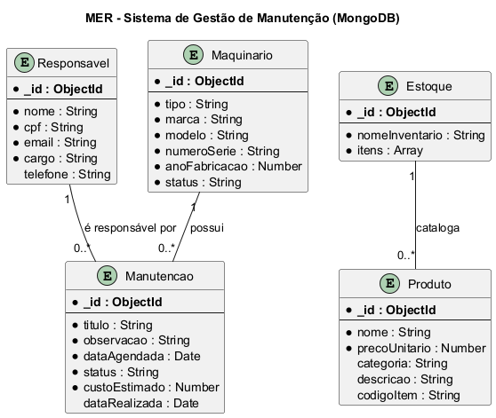

# 4. Persistência de Dados

Esta seção detalha a estrutura e a definição dos dados do **Sistema de Gerenciamento de Estoque e Frota (SGEMF)**. Aqui estão os artefatos que definem como as informações são organizadas, armazenadas e relacionadas no banco de dados.

## 1. Modelo Entidade-Relacionamento (MER)

O diagrama a seguir representa visualmente as tabelas do nosso banco de dados relacional, suas colunas e como elas se conectam através de chaves primárias e estrangeiras. Ele é a planta baixa da nossa camada de dados.

---

## 2. Dicionário de Dados

O dicionário de dados é um documento complementar ao MER que fornece uma descrição detalhada de cada campo (coluna) em cada uma das nossas tabelas (entidades). Ele define o tipo de dado, a descrição, restrições e regras de negócio aplicáveis a cada atributo.

Para uma consulta completa de todas as entidades e seus respectivos campos, acesse o documento abaixo:

### **➡️ [Acessar o Dicionário de Dados Completo](./DicionarioDados.md)**

## 3. Conclusão
Em conjunto, o Modelo Entidade-Relacionamento e o Dicionário de Dados fornecem um projeto completo e detalhado para a camada de persistência. Estes documentos garantem que a implementação do banco de dados seja bem definida.